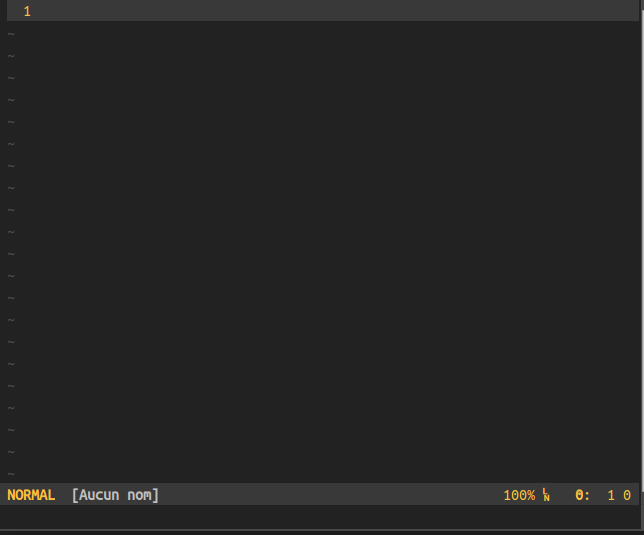

# vBox - <small>A simple template engine for vim</small>


Introduction
------------

A simple vim plugin for quickly create and insert templates.



### Features

- Templates specific to file types or file names.
- Customizable template variables.
- Command completion.
- Live template creation & edition.

### Cons

- No templates by default, create your own.
- No auto insertion by default (Use `BufNewFile` for that).
- The file type matching is done according to the current `&ft`, not the extension.

Quick start
-----------

Define a directory where the templates will be stocked:

```vim
let g:vbox = {'dir': 'path/to/folder'}
```

Then use `:VBEdit [filetype or filename]` to create/edit templates and `:VBTemplate [template]` to insert them.

Installation
-----------

Use your preferred method to install the plugin. I recommend you to use a plugin manager.

e.g with [Vim-plug](https://github.com/junegunn/vim-plug)

```vim
Plug 'KabbAmine/vBox.vim'
```

Commands
--------

The plugin provides 2 commands:

-----------------

```vim
:VBTemplate [template]
```

Use it to:

- Expand `[template]` if its given.
- Define automatically the [appropriate template<sup>T</sup>](#star) and expand it if `[template]` is not given.

-----------------

```vim
:VBEdit [template]
```

When executed open a vim split and:

- Edit the [appropriate template<sup>T</sup>]("#star") if `[template]` is not given.
- Edit `[template]` if its given and exists in your templates.
- Create[<sup>N</sup>](#new) a new file named `template` if `[template]` is given but does not exist.

-----------------

- *Template names can be completed using `Tab` for both commands.*
- *<a id="star"><sup>T</sup></a> The plugin defines appropriate template from the file name or the file type.*
- *<a id="new"><sup>N</sup></a> Before creating the file, if the given template name does not start with `f=` or `t=`, the plugin asks for the template's type (See next part).*

### About templates

**There are no templates provided by default, so if needed, we can create another repository specially for them.**

----------------
The plugin supports 2 kinds of templates

1. `t=filetype`: File type template (e.g. `t=python`, `t=vim`...)

	They are normal templates that match a certain file type, `t=html` for html files, `t=c` for C files and so on...

2. `f=filename`: File name template (e.g. `f=README.md`, `f=.aVeryUsefulConfigFile`...)

	Those templates should match the entire file name and are very useful for common files or portions of code (readme, license, config files, vim plugin skeleton...).

The templates should be in `g:vbox.dir` directory (See [configuration](#configuration)).

You can use template variables (placeholders) that will be replaced or evaluated when the templates are generated (e.g `%FILE%` will be replaced by the current file name without extension), see [template variables](#variables).

**P.S:** You can check [my own templates](https://github.com/KabbAmine/myVimFiles/tree/master/various/templates) to have an idea.


Configuration <a id="configuration"></a>
-------------

The configuration of the plugin is stocked in one global dictionary `g:vbox`.

To define/modify an option you can either:

```
let g:vbox = {}
let g:vbox.option1 = 'foo'
let g:vbox.option2 = 0
```

Or:

```vim
let g:vbox = {
			\ 'option1': 'foo',
			\ 'option2': 0
		\ }
```

### Options

| option                    | description                                         | default                 |
| ------------------------- | --------------------------------------------------- | -------------------     |
| `dir`                     | Templates location                                  | `''`                    |
| `empty_buffer_only`       | Expand templates only if the buffer is empty        | `1`                     |
| `verbose`                 | Echoes informations (*Keep it to 1*)                | `1`                     |
| `edit_split`              | Split directions when using `VBEdit`                | `'rightbelow vertical'` |
| `variables`               | See [template variables](#variables)                |

There is no option for auto-insertion of templates, but you can easily make such functionality using `BufNewFile` event, check [the examples in my configuration](#myconfiguration)

### Template variables <a id="variables"></a>

The plugin defines a few variables that will be expanded:

| pattern                   | result                      |
| ------------------------- | -------------------------   |
| `%_%`                     | Cursor position             |
| `%DATE%`                  | e.g. 2016-01-22             |
| `%EXT%`                   | File extension              |
| `%FILE%`                  | File name without extension |
| `%HOSTNAME%`              | Host name                   |
| `%TIME%`                  | e.g. 16:47                  |
| `%USER%`                  | Username                    |

You can add you own patterns or overwrite the default ones (Except `%_%`) in `g:vbox.variables` (The syntax is `%PATTERN%`).

e.g.

```vim
let g:vbox.variables = {
			\ '%FOO%'  : 'bar',
			\ '%USER%' : 'Mister Foo'
		\ }
```

You can also use vim expressions or funcref, just put `f=` before the value.

e.g.

```vim
let g:vbox.variables = {
			\ '%CWD%' : 'f=getcwd()',
			\ '%YEAR%': 'f=strftime("%Y")'
		\ }
```

Those values will be evaluated using `eval()`.

---------------------------

Check my [configuration](#configuration) for more examples.

## My configuration <a id="myconfiguration"></a>

```vim
nnoremap <S-F2> :VBEdit 
let g:vbox = {
			\ 'dir': '~/.vim/various/templates',
			\ 'empty_buffer_only': 0
		\ }
let g:vbox.variables = {
			\ '%NAME%'     : 'Kabbaj Amine',
			\ '%MAIL%'     : 'amine.kabb@gmail.com',
			\ '%LICENSE%'  : 'MIT',
			\ '%PROJECT%'  : 'f=fnamemodify(getcwd(), ":t")',
			\ '%YEAR%'     : 'f=strftime("%Y")'
		\ }
augroup VBoxAuto
	autocmd!
	autocmd BufNewFile README.md,CHANGELOG.md       :VBTemplate
	autocmd BufNewFile LICENSE                      :VBTemplate license-MIT
	autocmd BufNewFile *.py,*.sh,*.php,*.html,*.js  :VBTemplate
augroup END
```

## TODO

- [x] A doc file

## Notes

Even if the plugin works as expected, it needs more testing, so feel free to report issues and submit PR on the github repository https://github.com/kabbamine/vBox.vim

Thanks to Bram Moolenaar for creating the best piece of software in the world :heart:

Thanks to you if you're using vBox.

## License

MIT
